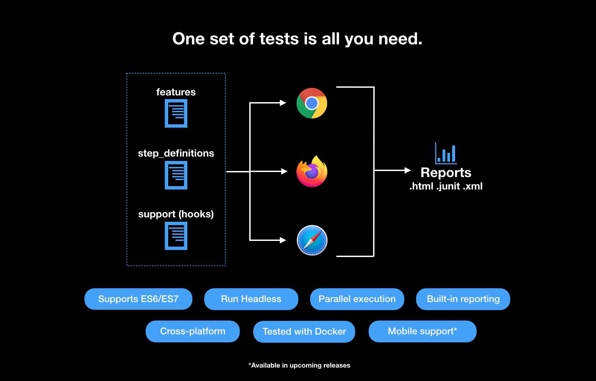

Hello! 👋🏼

Test Concerto is a open-source npm package that integrates Selenium, Playwright, Appium, WebdriverIO & CucumberJS for an all-round UI testing experience in Behaviour-driven development (BDD). You can check the "Projects" section of GitHub to keep track of our progress.



:::info
Any existing test suite written with eol-ft-runner is fully backwards-compatible with Test Concerto, after updating the library imports to use `test-concerto` instead of `eol-ft-runner`.
:::

## How to install

```shell
npm i test-concerto -D
```

## Browser Support status

| Browser          | macOS/Linux | Windows |
| ---------------- | ----------- | ------- |
| Chrome           | ✅          | ✅      |
| Chrome Headless  | ✅          | ✅      |
| Firefox          | ✅          | ✅      |
| Firefox Headless | ✅          | ✅      |
| Safari           | ✅          | N/A     |
| Edge             | ✅          | ✅      |
| Edge Headless    | 🛠 WIP       | 🛠 WIP   |
| Android Chrome   | ✅          | ✅      |
| iOS Safari       | ✅          | N/A     |
| Opera            | ❌          | ❌      |
| Brave            | ❌          | ❌      |

## Mobile App status

| Platform    | macOS/Linux | Windows |
| ----------- | ----------- | ------- |
| Android App | ✅          | ✅      |
| iOS App     | ✅          | N/A     |
